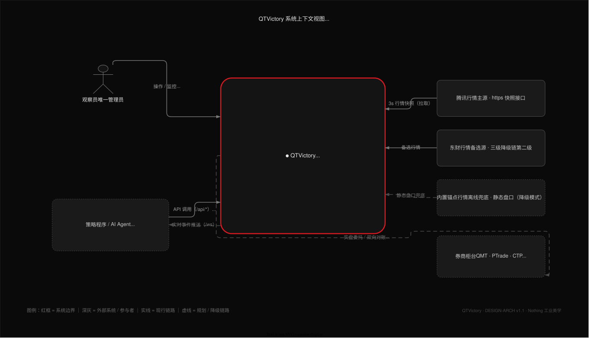
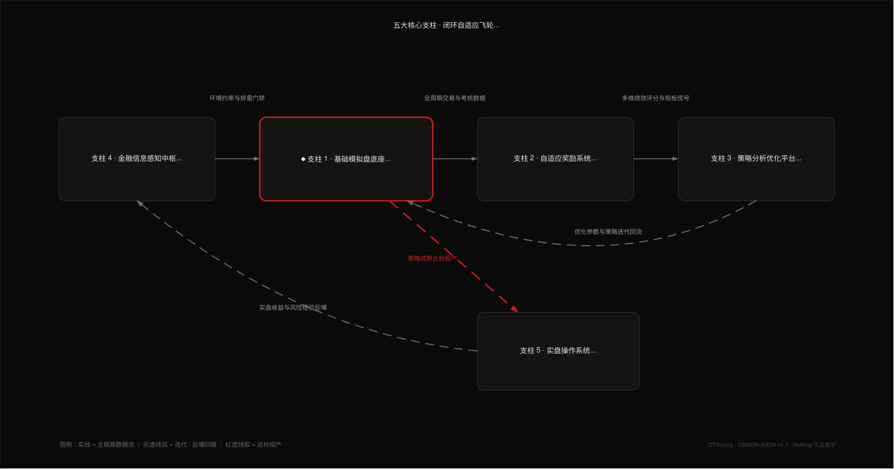
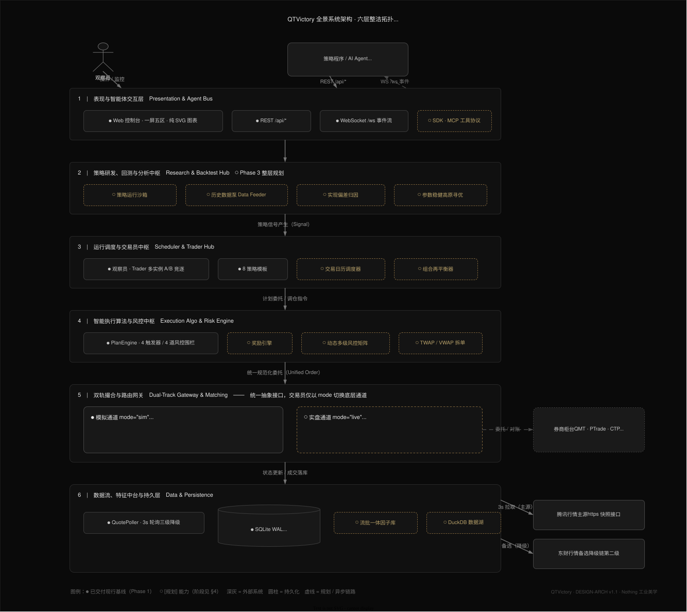
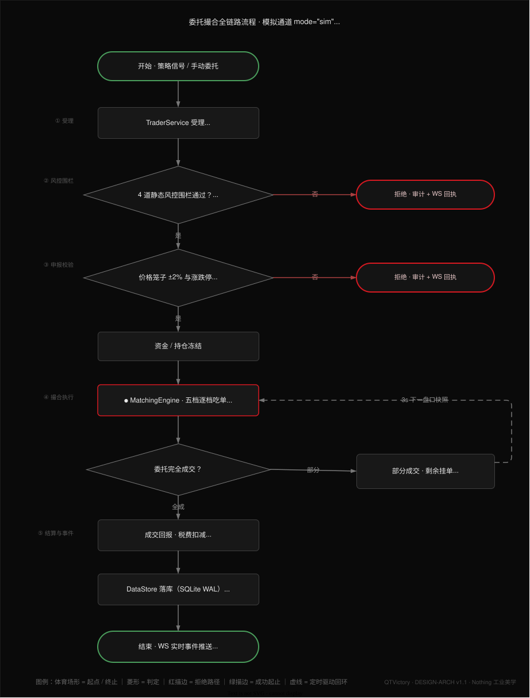
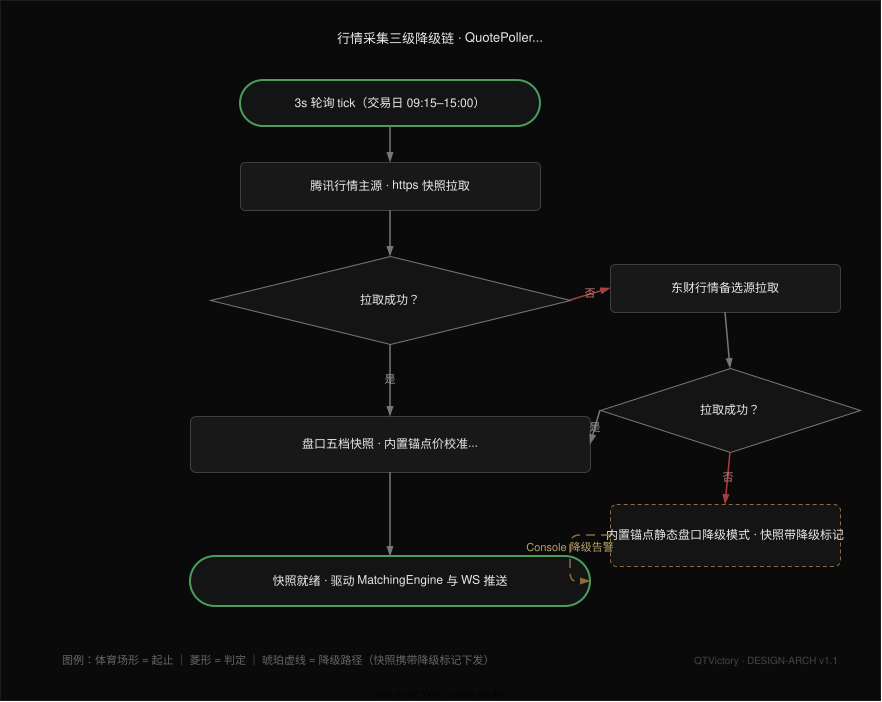

# QTVictory 宏观架构与演进设计方案

> **文档ID**: DESIGN-ARCH ｜ **版本**: v1.1 ｜ **状态**: 现行基线
> **最后更新**: 2026-09-18 ｜ **关联变更**: 无

---

## 1. 系统定位与设计哲学

### 1.1 系统核心定位
QTVictory 旨在从一个**高保真单机 A 股模拟交易沙盒**演进为一个**闭环自适应的私人量化交易系统**。系统通过打通“**信息感知 → 策略模拟演练 → 周期自适应奖励 → 深度归因调优 → 实盘安全投产**”全链路，解决量化策略在离线回测、前向模拟与真金白银实盘之间普遍存在的滑点失真、规则失真、过度拟合与操作脱节问题。

**图 1 · 系统上下文（C4 Level 1）**：观察员（唯一管理员）经 Web 控制台操作与监控系统；策略程序 / AI Agent（规划的 Python SDK / MCP 接入）与控制台共享 API-First 全能力；系统外部仅依赖腾讯行情主源与东财备选源，内置锚点行情为离线兜底，券商柜台（QMT / PTrade / CTP）为 Phase 5 规划的实盘通道。

### 1.2 五大核心支柱与飞轮演进

五大支柱构成一个闭环自适应飞轮（图 2）：**金融信息感知中枢（支柱 4）** 输出环境约束与排雷门禁 → **基础模拟盘底座（支柱 1）** 承载策略前向演练（全系统演进的事实底座与飞轮枢纽）→ **自适应奖励系统（支柱 2）** 输出微观执行与宏观周期的多维考核 → **策略分析优化平台（支柱 3）** 诊断归因、寻优参数并回流底座迭代 → 策略成熟后**达标投产实盘操作系统（支柱 5）**，实盘收益与风控经验再反哺感知层。图中实线为主链路数据流，虚线为迭代 / 投产 / 反哺流；各支柱对应的交付阶段见 §4 演进路线图。

---

## 2. 全景系统架构分层拓扑

系统自顶向下划分为六层整洁架构（图 3），核心状态由 Python 异步事件循环与无 I/O 纯函数内核驱动，层间自顶向下单向依赖：

图中 ● 为已交付现行基线（Phase 1），○ 为规划能力（对应阶段见 §4）；右侧为外部系统（行情源 / 券商柜台），虚线为规划或异步链路（如 /ws 实时事件回流至策略程序）。

### 2.1 层级与设计事实源对照

各层的详细规则以对应设计方案为唯一事实源，本方案仅约束宏观分层与演进方向：

| 层级 | 落点设计事实源 |
|---|---|
| 1 表现与智能体交互层 | [01 v4.3](01-前端设计方案.md)（一屏五区 §2.1 / 主题体系 §3.1 / 纯 SVG 图表 §5） |
| 2 策略研发、回测与分析中枢 | 规划中（Phase 3 立项后出详细设计） |
| 3 运行调度与交易员中枢 | [02 v4.0](02-后端设计方案.md)（TraderService §3.5 / 策略模板与计划引擎 §6.7） |
| 4 智能执行算法与风控中枢 | [02 v4.0](02-后端设计方案.md)（PlanService §3.7 / 计划引擎 §6.7） |
| 5 双轨撮合与路由网关 | [02 v4.0](02-后端设计方案.md)（MatchingEngine §6.1）；实盘通道 Phase 5 立项后出详细设计 |
| 6 数据流、特征中台与持久层 | [02 v4.0](02-后端设计方案.md)（MarketService §3.4 / QuotePoller §6.5 / SQLite Schema §6.2） |

---

## 3. 核心机制宏观设计

### 3.1 基础模拟盘底座（已就位现行基线）
- **职责**：提供零外部依赖的 A 股制度级实时仿真环境。
- **架构契约**：
  - 核心撮合 `MatchingEngine` 为无 I/O 纯函数，接收盘口快照、委托单、历史成交量基数与规则配置，输出成交与资产变动（详见 02 v4.0 §6.1）；
  - 观察员唯一且不直接交易，全部操作落入不可篡改的 `audit_log`；
  - 全部能力经 REST/WS 对外暴露，保证程序化调用与 Web UI 具备同等控制能力。

底座的两条关键运行时链路（图 4 / 图 5，规则细节以 [02 v4.0](02-后端设计方案.md) §6.1 / §6.5 为事实源）：

**图 4 · 委托撮合全链路**：委托经 `TraderService` 受理后依次通过 4 道静态风控围栏与价格笼子（±2%）申报校验，冻结资金 / 持仓后进入 `MatchingEngine` 五档逐档吃单；校验未过的委托被拒绝并落审计 + WS 回执（红色分支），部分成交的剩余挂单在下一个 3s 盘口快照到达时继续撮合（虚线回环），完全成交后经税费扣减、T+1 结算落库并经 /ws 推送实时事件。

**图 5 · 行情三级降级链**：`QuotePoller` 以 3s 周期拉取腾讯行情主源；主源失败降级东财备选源，再失败启用内置锚点静态盘口（降级模式，Console 告警）；任一级成功即产出经锚点价校准的五档快照，驱动撮合引擎与 WS 推送。

### 3.2 周期自适应奖励系统（Phase 2 核心）
- **核心痛点**：单维胜率会导致策略产生“死扛不平仓、拒绝止损”的病态倾向；且短线、波段与长线策略考核维度完全不同。
- **架构机制**：
  1. **微观执行层奖励（秒级即时反馈）**：全周期通用，考核委托与撮合微观质量（计划外滑点、价格笼子拦截率、风控违规率）；
  2. **宏观绩效层奖励（策略周期自适应，异步结算）**：
     - **短线交易员（日内）**：考核扣除印花税与佣金后的单笔净收益期望、胜率、日内最大单笔亏损；
     - **波段交易员（数日/数周）**：彻底放弃高胜率要求，考核盈亏比（Payoff Ratio）、卡玛比率（年化收益/最大回撤）、回撤修复时间；
     - **长线交易员（数月/季度）**：考核超越沪深300基准的超额收益（Alpha）、信息比率（IR）、低换手率惩罚；
  3. **置信度检验**：基于样本量计算 p-value，小样本（< 30 笔）下限制评分权重，防范随机游走噪声诱导。

### 3.3 策略分析优化与回测平台（Phase 3 核心）
- **核心痛点**：模拟盘实时交易样本少，直接根据短期模拟盘亏损调参是教科书级的过拟合（Data Snooping Bias）。
- **架构机制**：
  1. **实现偏差归因（Implementation Shortfall）**：分析平台不直接发明参数，而是比对“回测理论期望”与“模拟盘真实成交”，定位滑点损耗与延迟偏差；
  2. **历史数据泵与回测引擎**：复用 `MatchingEngine` 纯函数内核（02 v4.0 §6.1），将输入从实时轮询快照替换为历史行情流泵，提供多标的高速事件驱动回测；
  3. **参数稳健高原（Robust Plateau）寻优**：通过网格搜索与敏感度分析，寻找参数宽泛有效区间，避免尖峰过拟合参数。

### 3.4 金融信息感知与舆情排雷中枢（Phase 4 核心）
- **核心痛点**：公开财经新闻信噪比极低，信息已被二级市场消化，直接用大模型研报分析调整策略参数会导致策略频繁打脸。
- **架构机制**：
  1. **信息做减法（负向排雷门禁）**：信息分析不用于预测明天涨跌，而是产出“黑天鹅排雷清单”（业绩预亏、立案调查、重组失败），直接作为交易计划引擎的硬阻断门禁；
  2. **宏观市场状态识别（Regime Detection）**：通过行业研报与宏观指标，输出全局状态标签（高波震荡、低波阴跌、单边主升），动态指导观察员启停对应策略实例（如震荡市启用网格、单边市启用趋势突破）。

### 3.5 实盘操作系统与双轨路由网关（Phase 5 核心）
- **核心痛点**：模拟盘到实盘存在真实流动性冲击、网络断线、状态不同步与穿仓风险。
- **架构机制**：
  1. **代码零改动投产（Zero-Code Migration）**：统一抽象执行网关接口，交易员实例仅通过 `mode="sim"` 与 `mode="live"` 切换底层通道，上层策略逻辑与 API 契约 100% 不变；
  2. **强一致性异步对账状态机**：严密管理 `PendingNew`、`PartiallyFilled`、`PendingCancel` 等异步状态；独立后台线程每 5 秒与券商柜台进行资金持仓穿透对账，账实不符立即阻断新开仓；
  3. **算法拆单引擎（TWAP / VWAP / 冰山委托）**：大单自动切片分批送入，削减市场冲击成本；
  4. **物理级硬熔断器（Hard Kill-Switch）**：独立于策略与 AI 之外的硬件/底层守护进程，单日累计亏损超限时一键市价全平并切断通道，不可被上层逻辑覆盖。

---

## 4. 阶段划分与演进路线图

| 阶段 | 阶段代号 | 核心系统目标 | 关键交付物 | 现行状态 |
|---|---|---|---|---|
| **Phase 1** | **模拟底座与控制台** | 建立实时前向仿真基础底座与监控台 | 纯函数撮合内核 + 3s 快照轮询 + 观察员体系 + 计划引擎 + Nothing Web 控制台 | **【✅ 现行交付基线】**（已通过 M8 / M16 终验） |
| **Phase 2** | **周期自适应奖励系统** | 解决“如何科学多维评价策略” | 微观执行滑点考核 + 周期自适应（短线/波段/长线）绩效评分矩阵 + 胜率置信度检验 | **【📋 规划中 / 待立项】** |
| **Phase 3** | **策略分析平台与回测引擎** | 解决“如何基于数据科学调参” | 历史行情数据泵 + 纯函数回测引擎 + 实现偏差归因 + 参数稳健高原寻优工具 | **【📋 规划中】** |
| **Phase 4** | **金融信息与舆情感知中枢** | 解决“外生环境识别与排雷防范” | 研报快讯文本清洗 + 负向风控排雷门禁 + 宏观市场状态识别 (Regime) | **【📋 规划中】** |
| **Phase 5** | **实盘操作系统与执行中枢** | 解决“真金白银安全稳健投产” | 券商量化接口网关 (QMT/PTrade) + 异步状态机对账 + 算法拆单 (TWAP/VWAP) + 物理硬熔断 | **【🔭 远期愿景】** |

---

## 5. 架构边界与非功能约束

1. **单机可控性**：在 Phase 1 ~ Phase 4 演进过程中，保持单机自部署的轻量与自愈特性，不盲目引入分布式重型组件；
2. **纯函数内核复用**：Phase 1 沉淀的 `MatchingEngine` 纯函数内核必须在 Phase 3 回测引擎中 100% 复用，禁止写两套不同的撮合规则；
3. **安全物理阻断**：实盘操作系统（Phase 5）的硬熔断器必须独立于应用层逻辑，具有单向最高物理截断权限；
4. **文档与设计治理先行**：任何后续阶段启动编码前，必须严格遵循“todo 登记 → design 方案细化与评审 → plan/task 拆解立项”规范，不在无设计方案的情况下堆砌代码。

---

## 6. 图源与维护

1. **载体**：本方案五张图（图 1 系统上下文 / 图 2 支柱飞轮 / 图 3 六层拓扑 / 图 4 撮合链路 / 图 5 行情降级链）均为 draw.io **可编辑 SVG**（`.drawio.svg`，图源 XML 内嵌于同一文件），位于 [assets/](assets/) 目录——GitHub / VS Code 直接渲染，draw.io desktop 直接打开编辑、保存即完成更新，无需维护独立图源文件；
2. **风格与图形语义基线**：沿用全站 Nothing 套系——`#0A0A0A` 底 / `#141414` 卡片 / `#D71921` 唯一强调红，绿色 `#4A9E5C` ● 标记已交付、琥珀 `#D4A843` ○ 标记规划中；图形语义统一约定：人形 = 人类参与者、圆柱 = 持久化存储、菱形 = 流程判定、圆角端点 = 起止、红描边 = 系统边界 / 核心组件、虚线 = 规划 / 异步 / 降级链路。修订图表时保持该语义约定不变；
3. **同步纪律**：层级职责、支柱关系或阶段状态发生实质变化时，须同步更新对应图表，避免图文漂移。

---

## 7. 相关文档

| 文档 | 关系 |
|---|---|
| [01-前端设计方案.md](01-前端设计方案.md)（v4.3） | 第 1 层表现层的事实源（布局、主题体系、图表与通信协议） |
| [02-后端设计方案.md](02-后端设计方案.md)（v4.0） | 第 3~6 层的事实源（领域模型、撮合内核、计划引擎、接口与持久层） |
| [todo/future.md](../todo/future.md) | 各阶段立项前的方向级缓冲登记 |

---

*变更记录：*
- *v1.1（2026-09-18）：编辑性升版——图表体系由 ASCII 字符画重绘为五张 draw.io 可编辑 SVG 专业图（Nothing 品牌风格、图源内嵌单文件，见 [assets/](assets/)）：图 1 C4 系统上下文视图（§1.1）、图 2 支柱飞轮管道 + 迭代回流弧（§1.2）、图 3 六层容器-组件拓扑（§2）、图 4 委托撮合全链路与图 5 行情三级降级链标准流程图（§3.1，判定菱形 / 分支 / 回环语义）；§6 增补图形语义约定与维护纪律；新增 §2.1 层级↔设计事实源对照表与 §7 相关文档，补齐与 01 / 02 的交叉引用；第 1 层表述不再约束主题数量，主题体系细节以 01 §3.1 为准。无业务规则变更。*
- *v1.0（2026-09-17）：首次定稿——宏观架构蓝图（五大支柱 / 六层拓扑 / 核心机制）与五阶段演进路线。*
